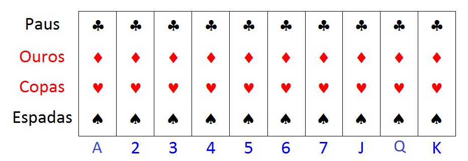
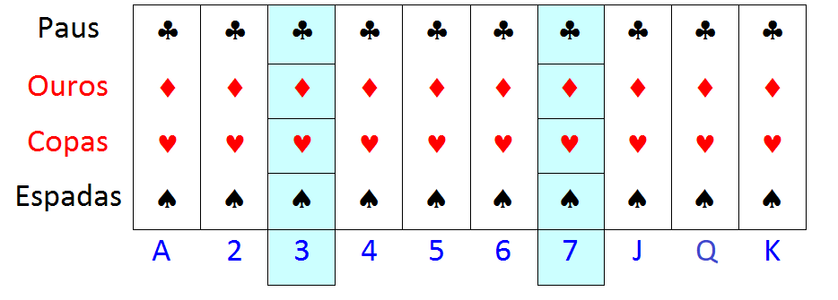
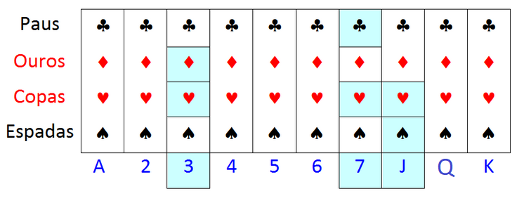

```{r libs, echo=FALSE, message=FALSE, warning=FALSE}
library(xaringanExtra)
library(emo)
library(fontawesome)
library(kableExtra)
```

```{r xaringan-logo, echo=FALSE}
# install.packages("remotes")
# remotes::install_github('yihui/xaringan')
# remotes::install_github("gadenbuie/xaringanExtra")
# xaringanExtra::use_logo(
#   image_url = "https://raw.githubusercontent.com/rstudio/hex-stickers/master/PNG/xaringan.png"
# )
xaringanExtra::use_logo( here::here('img/logo_dest.png'))
```

### *Housekeeping*

* Aproveitem o momento presencial para tirar dúvidas

* Se estivéssemos no ensino remoto ou à distância

  + vocês poderiam estar somente ouvindo, sem interação
  
  + ou assistindo vídeos e material em outro momento
  
* Depois das aulas, rever material da aula passada

  + fazer exercícios
  
  + se preparar para a próxima aula

---

## Aula passada `r emo::ji("disk")`
###  Avaliação Parcial 1

.center[
### Dúvidas?
]


---

##  Exercício 1 `r emo::ji("workout")`
#### (2,0 pontos) Revisar exercícios 1 e 2 com resolução nos slides 'Aula 08'.

* Quem já entregou, conferir seus resultados com a resolução atualizada nos slides da `Aula 08`.

  + Alguma discordância com a resolução?

* Quem fez parcialmente e/ou não entregou, ...

---

##  Exercício 2 `r emo::ji("workout")`
#### (2,0 pontos) Exercício 3 dos slides 'Aula 08' modificado.

  a. Conferir cálculos da letra (a) do exercício original nos slides da `Aula 08`.
  
  b. A alocação apresenta $n_h > N_h$? Se sim, como realocar?
  
  c. Apresente uma estimativa do faturamento total $T_y$ por ponto e por intervalo, de acordo com o realocamento em (b). Interprete.

*(bônus)*: No item (a), mostrar que tamanho da amostra para média é equivalente ao tamanho para o total, usando $V$ e a fórmula de $n$ adequados para cada caso.

---

##  Exercício 3 `r emo::ji("workout")`
#### (2,0 pontos) Banco de dados `Lucy`. (arquivo `Aula_AE_xxx.R`)

Assuma que o banco de dados `Lucy` represente uma população.

  a. Apresente o tamanho na população por estrato, os parâmetros média e variância populacionais da variável `Income`, por estrato e globias, usando `Zone` como variável estratificadora. Repita para a variável `Level` como estratificadora.
  
  b. Supondo **AASc** de 30 empresas em cada estrato, calcule a variância do estimador da média de `Income`, comparando o desempenho de `Zone` e `Level` como variáveis estratificadoras.

  c. Qual a melhor variável para estratificação? Justifique, por exemplo, calculando efeito de planejamento $EPA$ $(deff)$ em cada caso.
  
  d. Selecione uma amostra com a alocação definida no item (b) e obtenha uma estimativa pontual e intervalar para a média de `Income`. Interprete.

*(bônus)*: Adicionar comandos para obtet total de `Income`.

*(bônus 2)*: Adicionar comandos para obter proporção de `SPAM`.

---

##  Exercício 4 `r emo::ji("workout")` - *Assuma* **AASc** *dentro dos estratos*

#### (2,0 pontos) Exercício 4.4 (elementos de amostragem)
```{r echo=FALSE, fig.align='center', message=FALSE, warning=FALSE, out.width='90%', out.height='90%', paged.print=FALSE}
knitr::include_graphics(here::here('img', 'exerc_4-4_elementos-de-amostragem.png'))
```

---

##  Exercício 5 `r emo::ji("workout")` - *Assuma* **AASc** *dentro dos estratos*

####(2.0 pontos) Exercício 4.20 (elementos de amostragem)
```{r echo=FALSE, fig.align='center', message=FALSE, warning=FALSE, out.width='90%', out.height='90%', paged.print=FALSE}
knitr::include_graphics(here::here('img', 'exerc_4-20_elementos-de-amostragem.png'))
```

---

class: inverse, middle, center

# Amostragem por Conglomerados (*Cluster*)

---

## Amostragem por Conglomerados `r fa( "people-group", fill="red")` `r fa( "person", fill="red")` `r fa( "person-dress", fill="red")`
#### Por que usar amostragem por conglomerados (*clusters*)? `r emo::ji("family")` 

* Os métodos de amostragem que já vimos requerem:
    
    + **cadastros de unidades** elementares para selecionar a amostra; 
  
    + a seleção da amostra é feita num **único estágio** ou etapa; 
    
    + as **unidades de referência** são iguais às **unidades de amostragem**; 
    
    + e o **tamanho** total da população é **conhecido** com base no cadastro.

* A **amostragem conglomerada**, **por conglomerados** (ou **clusters**) é usada quando:

    + o cadastro não existir ou não puder ser construído; 
    
    + ou se o custo de construí-lo ou atualizá-lo for muito elevado.

* Grupos de unidades chamados de **conglomerados** são selecionados com probabilidades conhecidas, utilizando um dos métodos de seleção anteriormente apresentados. 
 
---

## Amostragem por Conglomerados `r fa( "people-group", fill="red")` `r fa( "person", fill="red")` `r fa( "person-dress", fill="red")`
#### Por que usar amostragem por conglomerados (*clusters*)? `r emo::ji("family")` 
  
* A **amostragem por conglomerados** consiste num esquema de amostragem em **estágios**;

    + em cada estágio a unidade amostral é formada por grupos ou subconjuntos (*conglomerados*) de unidades populacionais.
    
* A **formação de conglomerados** pode ser:

    + **Natural** (ex. turma de alunos, edifício de apartamentos, quarteirão, município);
    
    + **Planejada**, quando os grupos são definidos pelo estatístico de acordo com o objetivo da pesquisa (ex.: grupos de seis alunos que sentam na mesma fileira numa sala de aula, grupos de dez peças industriais do mesmo tipo saindo de uma linha de produção, grupos de cinco endereços residenciais no mesmo setor censitário, etc.).

---

## Amostragem por Conglomerados `r fa( "people-group", fill="red")` `r fa( "person", fill="red")` `r fa( "person-dress", fill="red")`
#### Por que usar amostragem por conglomerados (*clusters*)? `r emo::ji("family")` 
 
* A **unidade populacional** depende da análise que está sendo feita e é determinada pelo **propósito da pesquisa** e não pelo plano amostral. Pode acontecer de mais de uma unidade populacional estar envolvida na pesquisa quando, por exemplo, características de domicílios e de pessoas são investigadas no mesmo levantamento. 

* Não há uma definição fixa para grupos que podem ou não ser considerados como conglomerados. 

* Ex. turmas de alunos

    + tanto podem ser unidades populacionais de referência (se estivermos interessados em investigar o número de alunos por turma como variável resposta),
    
    + como podem ser conglomerados de alunos (se estivermos interessados em investigar o aproveitamento individual dos alunos).

* Os vários métodos de amostragem já discutidos podem ser aplicados para implementar a amostragem conglomerada,

    + onde os conglomerados passam a ser as unidades amostrais a serem objeto de seleção pelos diferentes métodos.

---

## Amostragem por Conglomerados `r fa( "people-group", fill="red")` `r fa( "person", fill="red")` `r fa( "person-dress", fill="red")`
#### Amostragem de áreas `r emo::ji("map")` `r emo::ji("map")` `r emo::ji("map")`

* **Amostragem de áreas** se dá quando 

    + não existe um cadastro de boa qualidade disponível 
    
    + e/ou quando a população for muito dispersa e o fator custo de deslocamento for preponderante. 

* A necessidade de uma lista atualizada das unidades para as quais se requer a informação é restrita às áreas (*conglomerados*) que forem selecionadas para a amostra. 
    
* A grande vantagem da amostragem conglomerada é a sua conveniência operacional vinculada a possíveis reduções de custo. 

---

## Amostragem por Conglomerados `r fa( "people-group", fill="red")` `r fa( "person", fill="red")` `r fa( "person-dress", fill="red")`
#### Amostragem de áreas `r emo::ji("map")` `r emo::ji("map")` `r emo::ji("map")`

* Ex. levantamento de uma população humana, é operacionalmente mais conveniente pesquisar todas as pessoas numa amostra de domicílios do que selecionar o mesmo número de pessoas espalhadas por toda a população. 

* Também é mais conveniente pesquisar todos os domicílios numa amostra de áreas (por exemplo, setores censitários) do que selecionar aleatoriamente uma amostra do mesmo número de domicílios numa lista de todos os domicílios da região de interesse da pesquisa. Por um lado, tal lista nem sempre está disponível e, por outro, seu preparo tornaria a pesquisa bem mais cara. 

* Suponha que uma AAS de $n=400$ domicílios deva ser selecionada de uma população de $N=10.000$ domicílios de uma cidade. Como não dispomos de uma lista atualizada com todos os domicílios, optamos por uma amostra de domicílios localizados dentro de uma amostra de quarteirões. Isto pode ser feito dividindo a área da cidade em quarteirões e selecionando 1/25 dos quarteirões. A probabilidade de selecionar um domicílio na cidade é a probabilidade de selecionar um quarteirão, ou seja, $1/25 = 400/10.000$. Neste caso, o tamanho da amostra de domicílios será uma variável aleatória que depende dos quarteirões selecionados para a amostra, sendo o seu valor esperado igual ao $n$ desejado.

    + Nesse exemplo, as unidades amostrais são os quarteirões da cidade, que poderiam ser listados para formar o cadastro de seleção. A seleção da amostra de quarteirões determina a seleção dos domicílios que estão localizados nos quarteirões. Se todos os domicílios de cada quarteirão são pesquisados, então a amostra é conglomerada em um estágio.

---

## Amostragem por Conglomerados `r fa( "people-group", fill="red")` `r fa( "person", fill="red")` `r fa( "person-dress", fill="red")`
#### Amostragem de áreas `r emo::ji("map")` `r emo::ji("map")` `r emo::ji("map")`

* Mesmo que a lista de todos os domicílios esteja disponível, reduções do custo podem ser observadas na amostra conglomerada, pois a localização e identificação dos 400 domicílios espalhados aumenta o custo de transporte, bem como demanda maior tempo para a coleta, em comparação com a localização dos quarteirões selecionados e visita a todos os domicílios destes quarteirões. Por outro lado, para um dado tamanho de amostra, a amostragem direta dos domicílios dá resultados mais precisos do que a amostragem conglomerada de domicílios. 

* Se comparamos uma amostra conglomerada com uma amostra de unidades elementares do mesmo número de unidades elementares, em geral, na amostra conglomerada espera-se que:

- O custo por unidade elementar seja mais baixo, devido ao mais baixo custo de listagem, de localização das unidades ou de ambos.     
- A variância de estimativas amostrais seja maior, dependendo do grau de homogeneidade das unidades agrupadas em conglomerados. 

Então verifica-se que a amostragem conglomerada impõe vantagens (menor custo) e desvantagens (menor precisão). Levando em conta os aspectos operacionais e a redução de custos que a amostragem conglomerada proporciona, em muitas situações práticas, a perda de eficiência amostral é mais que compensada por essa vantagem. Além disso, a redução de custos proporcionada pode permitir selecionar amostras maiores, compensando assim a perda de precisão em relação a amostras não conglomeradas. 

Uma aplicação importante de amostragem (conglomerada) de áreas se dá nas pesquisas domiciliares do IBGE, através da utilização da *Base Operacional Geográfica - BOG* que tem como suas menores áreas os setores censitários, conforme descrito na Seção \@ref(cadIBGE).   

---

## Amostragem por Conglomerados `r fa( "people-group", fill="red")` `r fa( "person", fill="red")` `r fa( "person-dress", fill="red")`

#### Exemplo 7.1 do livro 'Elementos de Amostragem'.

Considere uma população de $N=6$ unidades agrupadas em $M=3$ conglomerados do seguinte modo:

$$U = \left\{ (1), (2,3,4), (5,6) \right\}.$$
Nesse caso, os conglomerados são 

$$C_1 = (1), C_2 = (2,3,4) \: \: e \: \: C_3 = (5,6).$$

O plano amostral adotado seleciona uma amostra de tamanho $m=2$ conglomerados, sem reposição, e observa todos os elementos do conglomerado. Dessa forma temos 

$${M \choose m} = {3 \choose 2} = 3 \text{ possíveis amostras}.$$

---

## Amostragem por Conglomerados `r fa( "people-group", fill="red")` `r fa( "person", fill="red")` `r fa( "person-dress", fill="red")`

#### Exemplo 7.1 do livro 'Elementos de Amostragem'.

São elas

$$\mathcal{S}_c (U) = \left\{ (C_1,C_2),  (C_1,C_3),  (C_2,C_3) \right\},$$

ou

$$\mathcal{S} (U) = \left\{ (1,2,3,4),  (1,5,6),  (2,3,4,5,6) \right\}.$$

O tamanho da amostra nesse caso é uma variável aleatória, que assume os possíveis valores: 3, 4 e 5.

---

## Amostragem por Conglomerados `r fa( "people-group", fill="red")` `r fa( "person", fill="red")` `r fa( "person-dress", fill="red")`

#### Definições básicas e notação

* A população de unidades $U$ é particionada em $M$ grupos **mutuamente exclusivos e exaustivos**, chamados **conglomerados**, denotados $C_1, ..., C_i, ..., C_M$, 

$$U = C_1 \cup C_2 \cup \dots \cup C_M = \bigcup_{i=1}^M C_i \quad \text{  e  }\quad C_i \cap C_k = \emptyset, i \ne k$$

* As unidades populacionais dentro de cada conglomerado são indexadas por $(i,j)$, onde $i$ designa o conglomerado e $j$ designa o rótulo da unidade elementar dentro do conglomerado. 

  + $C_i = \{ (i,1), (i,2), \dots, (i,j), \dots, (i,N_i) \}$, para $i=1,2,...,M$, onde $N_i$ é o tamanho do conglomerado $C_i$. 

  + $N = N_1 + N_2 + \dots + N_M$ é o tamanho total da população. 

* Selecione uma amostra $a = \{i_1,\dots,i_m\}$ de tamanho $m>0$, entre os rótulos de $C = \{1, ..., M\}$, segundo um plano amostral $p(a)$.

---

## Amostragem por Conglomerados `r fa( "people-group", fill="red")` `r fa( "person", fill="red")` `r fa( "person-dress", fill="red")`


#### Exemplo 7.2 do livro 'Elementos de Amostragem'.

Assumindo o mesmo plano amostral do Exemplo 7.1, compararemos três possíveis divisões de conglomerados de mesmo tamanho, $N_i = \overline N = 2$, para todos $i=1, , 3$:

$$\boldsymbol{Y}_A = ((7, 8); (9, 10); (12, 14))$$
$$\boldsymbol{Y}_B = ((7, 10); (12, 8); (9, 14))$$
$$\boldsymbol{Y}_C = ((7, 14); (12, 8); (9, 10))$$

* Qual a distribuição amostral da média amostral sob **AC**, $\overline y_{AC1} = \frac{\sum_{i \in a} T_i}{N}$, para uma amostra de $m = 2$ conglomerados nos três casos? 

  + Mostre $E( \overline y_{AC1})$ e $Var( \overline y_{AC1})$. 
  
  + Qual a melhor estratégia?

---

## Amostragem por Conglomerados `r fa( "people-group", fill="red")` `r fa( "person", fill="red")` `r fa( "person-dress", fill="red")`

#### Estratos *versus* conglomerados

Observe que, de um ponto de vista matemático, a definição da partição da população em conglomerados apresentada é muito semelhante à definição da partição em estratos, vista no Capítulo \@ref(estrat). A diferença fundamental entre amostragem *estratificada* e *conglomerada* é que, na primeira, selecionamos diretamente amostras de unidades elementares dentro de cada um dos $H$ grupos (estratos) formados, enquanto que, na segunda, selecionamos uma amostra de grupos (conglomerados) entre os $M$ grupos formados, tratando então os grupos como unidades de amostragem, e investigamos unidades elementares, apenas, dentro dos conglomerados selecionados. 

Outra diferença importante se dá no processo da formação dos grupos. Para alcançar eficiência, quando estamos definindo grupos para servirem como estratos, o ideal é que estes sejam internamente homogêneos, cada um formado por unidades parecidas entre si. Já quando vamos usar os grupos como unidades de amostragem (conglomerados), então idealmente devem ser internamente heterogêneos, cada um formado por unidades que representem o melhor possível a diversidade da população. Em termos de variabilidade, uma boa estratificação é aquela onde a variância *dentro* dos estratos é pequena e a variância *entre* os estratos é grande, enquanto que na amostragem conglomerada busca-se o contrário, com a variância *dentro* dos conglomerados *grande* e a variância *entre* eles pequena. 

---

## Amostragem por Conglomerados `r fa( "people-group", fill="red")` `r fa( "person", fill="red")` `r fa( "person-dress", fill="red")`

#### Definições básicas e notação

**(#exm:exmcon0)** Os setores censitários da Base Operacional Geográfica do IBGE

Um exemplo que ilustra bem a diferenciação do papel que estruturas de grupos de unidades populacionais podem ter no planejamento amostral é dado pelos setores censitários da Base Operacional Geográfica do IBGE. Estes setores são formados por áreas delimitadas no mapa do território brasileiro e podem ser vistos como grupos de domicílios e seus moradores. Na maioria das pesquisas amostrais do IBGE, tais como a PNAD Contínua - ver, por exemplo, @Freitas2014 - ou a POF - ver mais informações no link -  <https://www.ibge.gov.br/estatisticas/sociais/rendimento-despesa-e-consumo/9050-pesquisa-de-orcamentos-familiares.html?=&t=conceitos-e-metodos> - os setores censitários são usados como conglomerados para seleção da amostra de domicílios e pessoas que serão alvo da pesquisa. 

Essa mesma estrutura de grupos serve como estratos no caso da seleção de domicílios do Censo Demográfico que vão responder ao questionário mais longo, denominado de questionário da amostra. Nessa operação, em cada setor censitário, uma amostra de domicílios é selecionada dentro de cada um dos setores censitários, dando a eles então este papel de estratos, e não de conglomerados - ver @IBGE2016 para detalhes. 

---

class: inverse, middle, center

# Amostragem por Conglomerados em Um Estágio

---

## Amostragem por conglomerados em um estágio  

* Num plano de **Amostragem por Conglomerados em 1 estágio** **(AC1)**, todas as unidades populacionais dos conglomerados selecionados em $a = \left(i_1, \ldots, i_m \right)$ farão parte da amostra,

$$s = C_{i_1} \cup C_{i_2} \cup \dots \cup C_{i_m} = \bigcup_{k=1}^{m}C_{i_k}$$

Portanto, a amostragem do tipo AC1 é caracterizada pelos seguintes aspectos: 

- As unidades populacionais são reunidas em *grupos* denominados *conglomerados*.      

- Uma amostra de unidades é obtida selecionando uma *amostra de conglomerados* e *incluindo na amostra todas as unidades* pertencentes aos conglomerados selecionados.


---

## Amostragem por conglomerados em um estágio  

#### Exemplo:

Em um **baralho** cada **grupo** de um mesmo **número ou letra** $(A, 2, ..., 7, J, Q, K)$ representa um **conglomerado** de cartas dos quatro diferentes **naipes** (paus, ouros, copas e espadas).

<center>
```{r, baralho, echo=FALSE, fig.cap="", out.width="80%"}
 
```
</center>

* Uma amostra selecionada por amostragem do tipo **AC1**, os conglomerados são formados com as quatro cartas de cada número ou letra.

---

## Amostragem por conglomerados em um estágio  

#### Exemplo:

* A amostra selecionada de $m=2$ conglomerados (utilizando um dos métodos de seleção vistos anteriormente), resultou numa amostra de 8 cartas do baralho: 

    + 3 de paus, 3 de ouros, 3 de copas, 3 de espadas, 7 de paus, 7 de ouros, 7 de copas e 7 de espadas.  

<center>
```{r, baralhoAC1, echo=FALSE, fig.cap="", out.width="80%"}
 #{width=50%}
```
</center>

---

class: inverse, middle, center

# Amostragem por Conglomerados em Vários Estágios

---

## Amostragem conglomerada em vários estágios 

* Caracterizada por unidades populacionais arranjadas em grupos conforme uma hierarquia, com seleção de grupos nos vários níveis da hierarquia até chegar às unidades elementares (de referência) da pesquisa que serão investigadas.

* No exemplo do baralho, uma ilustração de **amostragem conglomerada em dois estágios** - **AC2** 

<center>
```{r, baralhoAC2, echo=FALSE, fig.cap="", out.width="80%"}
 #{width=50%}
```
</center>

* Foram selecionados os conglomerados - UPAs, 3, 7 e J (Valete) e, em cada um destes três conglomerados, selecionadas duas cartas, resultando numa amostra de seis cartas do baralho: 3 de ouros, 3 de copas, 7 de paus, 7 de copas, Valete de copas e Valete de espadas. 

* Populações humanas em geral são organizadas segundo uma hierarquia definida por regiões, estados, municípios, bairros, endereços, domicílios, famílias e pessoas. Além disso, existem hierarquias que podem ser utilizadas em amostragem conglomerada para investigação de unidades institucionais, nas áreas de agricultura, educação, negócios, saúde, cultura, etc.

---

## Amostragem conglomerada em vários estágios 

* Numa **amostragem conglomerada em três estágios**: 

    + **Unidades Primárias** de Amostragem - **UPA**s; 
    
    + **Unidades Secundárias** de Amostragem - **USA**s; 
    
    + e **unidades elementares**. 

* Tal estratégia consiste no arranjo da população em UPAs, as quais são divididas em USAs, que contêm as unidades elementares, formando os 3 estágios sucessivos.

* Para selecionar uma amostra de unidades elementares que serão investigadas, deve-se proceder da seguinte forma:

    - **Estágio 1**: selecionar uma amostra de UPAs.

    - **Estágio 2**: selecionar uma amostra de USAs em cada uma das UPAs selecionadas no primeiro estágio.

    - **Estágio 3**: selecionar uma amostra de unidades elementares em cada uma das USAs selecionadas no segundo estágio, que irão compor a amostra, $s$, de unidades elementares a serem investigadas. 

---

## Amostragem conglomerada em vários estágios 

#### Exemplo 2

Considere que é preciso selecionar uma amostra de domicílios para uma pesquisa numa determinada região. 

* Não há uma listagem atualizada e disponível dos domicílios existentes na região, mas é possível obter a lista dos municípios que a formam.

* O IBGE disponibiliza um cadastro dos setores censitários existentes em cada um desses municípios. 

É possivel, então, selecionar uma amostra conglomerada em 3 estágios de domicílios mediante as seguintes etapas:

- **Estágio 1**: selecionar uma amostra de municípios, que neste caso serão as UPAs.

- **Estágio 2**: selecionar uma amostra de setores censitários - USAs - em cada um dos municípios selecionados no primeiro estágio.

- **Estágio 3**: selecionar uma amostra de domicílios em cada um dos setores selecionados. 

---

## Amostragem conglomerada em vários estágios 

#### Exemplo 2

* A amostra de domicílios a serem investigados na região será formada pela união das amostras de domicílios selecionadas em cada um dos setores selecionados. 

* Provavelmente será necessário fazer uma **atualização da lista dos domicílios** para cada um dos setores selecionados no segundo estágio antes de selecionar os domicílios, porém essa atualização só será necessária para os **setores selecionados**, e não para todos os setores da região, como seria necessário se a amostra fosse selecionada diretamente na região sem considerar os estágios referentes aos municípios e setores.

**Notas:**

1) Sem USAs, o esquema acima se torna amostragem conglomerada em dois estágios, ou amostragem conglomerada com subamostragem.     

2) O processo acima pode ser estendido para quatro ou mais estágios.     

3) Na prática, é raro ver planos com mais de três ou quatro estágios de seleção. 

---

## Amostragem conglomerada em vários estágios 

#### Exemplo 3

Como outros exemplos de estruturas com hierarquia, considere:

a) Conglomerados = **áreas num mapa**; e unidades elementares = **estabelecimentos agropecuários**.   

b) UPAs = **hospitais**; USAs = **enfermarias**; e unidades elementares = **pacientes**.     

c) UPAs = **escolas**; USAs = **turmas**; e unidades elementares = **crianças/estudantes**.    

d) Conglomerados = **veículos** cruzando um posto de pedágio; e unidades elementares = **passageiros** nos veículos.     

e) UPAs = **empresas industriais**; e unidades elementares = **unidades locais**. 

---

## Amostragem conglomerada em vários estágios 

#### Exemplo 4

Plano amostral da **Pesquisa Mensal de Emprego** - **PME** - na Região Metropolitana de São Paulo realizada pelo IBGE

* O plano amostral empregado na **PME** da RM de São Paulo era amostragem conglomerada em dois estágios, onde os setores censitários da Região Metroplitana de São Paulo eram as UPAs, e os domícilios particulares eram as USAs. 

* Em cada domicílio selecionado para a pesquisa, as unidades elementares eram os moradores. **Todos os moradores dos domicílios** selecionados eram pesquisados, sendo que somente os que tinham 10 anos ou mais de idade preenchiam a parte referente às características de ocupação e rendimento. 

* O plano é dito em dois estágios porque não havia sorteio de moradores dentro dos domicílios selecionados.

---

## Amostragem conglomerada em vários estágios 

#### Exemplo 4

* A amostra era de cerca de 430 setores por mês, com média de aproximadamente 18 domicílios selecionados em cada setor da amostra, resultando em aproximadamente 7.800 domicílios na amostra por mês.

* A **PME** foi encerrada em março de 2016, com a divulgação dos resultados referentes ao mês de fevereiro de 2016, tendo sido substituída, com metodologia atualizada, pela **Pesquisa Nacional por Amostra de Domicílios Contínua** - **PNAD Contínua**, que abrange todo o País. Detalhes sobre a PME podem ser vistos em <https://www.ibge.gov.br/estatisticas/sociais/trabalho/9180-pesquisa-mensal-de-emprego.html?=&t=o-que-e>.

---

## Amostragem conglomerada em vários estágios 

#### Exemplo 5

Amostra da **Pesquisa Nacional de Saúde do Escolar** - **PeNSE**

* Realizada pelo IBGE, em conjunto com o Ministério da Saúde, a **PeNSE** busca estudar aspectos como "a maior exposição a fatores de risco para a saúde, como uso de tabaco, consumo de álcool, alimentação inadequada e sedentarismo" em uma amostra de adolescentes que frequentam aulas em escolas públicas e privadas no território nacional. 

* **Plano amostral complexo** que envolve **estratificação**, **conglomeração**, seleção de amostras com **probabilidades desiguais**, que pode ser visto com mais detalhes em @IBGE2016b. 

* Em relação à amostragem conglomerada, são utilizados três estágios de seleção em cada um dos estratos definidos:
    - **Estágio 1**: UPAs - Municípios em cada um dos estratos.
    - **Estágio 2**: USAs - Escolas com turmas de alunos nas etapas de ensino de interesse em cada município selecionado.
    - **Estágio 3**: UTAs - Turmas de alunos nas etapas de ensino de interesse em cada escola selecionada.
  
Seria possível implementar um quarto estágio selecionando apenas uma parte dos alunos de cada turma selecionada para responderem ao questionário da pesquisa, porém por facilidades operacionais foi decidido pela inclusão de todos os alunos, de cada turma selecionada, na amostra final.

---

## Notação na amostragem por conglomerados em um estágio

Os **tamanhos populacionais** e da **amostra** na **AC1** para uma dada população são 

Definição | População | Amostra 
--|:--:|:--:
Conglomerados | $M$ | $m$
Unidades no conglomerado $i$ |  $N_i$ | $N_i$
Tamanho da população/amostra |  $N = \sum_{i\in C}N_i$ | $n = \displaystyle \sum_{i \in a} N_i$

* $C = \{1, ..., M\}$: índice dos conglomerados na população.

* $a = \left(i_1, \ldots, i_m \right)$: índice dos conglomerados selecionados para a amostra.

---

## Notação na amostragem por conglomerados em um estágio

Os parâmetros populacionais **total** e **média** por conglomerado e na população como um todo são dados por

Definição | Parâmetro
--|--
Valor da variável de pesquisa para unidade $j$ do conglomerado $i$ | $y_{ij}$                
Total no conglomerado $i$ | $T_i = \sum_{j \in C_i} y_{ij}$
Média no conglomerado $i$ | $\overline {Y_i} = {T_i}/{N_i} = \frac 1 N_i \sum_{j \in C_i} y_{ij}$
Total populacional |  $T = \sum_{i=1}^{M} T_i = \sum_{i \in C} T_i$
Média populacional por conglomerado | $\overline {Y_C} = T / M = \frac 1 M \sum_{i \in C} T_i$ 
Média populacional por unidade | $\overline Y = T / N = \frac 1 N \sum_{i \in C} T_i$

para $i = 1, \ldots, M \:$ e $\: j = 1, \ldots, N_i$.
---

## Amostragem conglomerada 

A amostragem conglomerada em um ou mais estágios deve ser adotada sempre que: 

1. *Não existe cadastro* de unidades elementares, mas existe (ou se pode construir) um cadastro de UPAs e, sendo necessário, cadastros de USAs, etc.    

2. *Concentrar a coleta* de dados em umas poucas localidades ou grupos de unidades reduz o custo de deslocamento entre unidades elementares.    

3. O *acesso* às unidades elementares pode depender de pontos de passagem controlados nalgum nível da hierarquia.     

4. A maior capacidade de supervisão do trabalho em grupos de unidades pode resultar em melhor qualidade dos dados a serem coletados.

---

## Para casa `r emo::ji("house")`

<!-- * Continuar os Exercícios e Entregar. -->

<!-- * Mostrar tamanho de amostra $n$ para AASc dentro dos estratos. -->

<!-- * Continuar exercícios do livro 'Amostragem: Teoria e Prática Usando R'    https://amostragemcomr.github.io/livro/estrat.html#exerc11 -->

<!-- * Fazer exercícios da lista 1. -->

* Ler o capítulo 12 do livro 'Amostragem: Teoria e Prática Usando R'.
  
* Rever os slides.

<!-- * Ler BOlfarine e Bussab...da seção 11.3 do livro 'Amostragem: Teoria e Prática Usando R'. -->

## Próxima aula `r emo::ji("stats")`

* Acompanhar o material no moodle.

Amostragem por Conglomerados

  + Amostragem por Conglomerados em Um Estágio simples - **AC1S**

  <!-- + Exercícios e Intervalos de confiança -->
  
  <!-- + Laboratório de <i class="fa-duotone fa-people-group"></i>`r fa("r-project", fill = "steelblue")` -->

---

## Muito obrigado!

```{r echo=FALSE, fig.align='center', message=FALSE, warning=FALSE, out.width='20%', out.height='20%', paged.print=FALSE}
knitr::include_graphics(here::here('img', 'image_basu_elephant.jpg'))
```
.center[
#### Fonte: imagem do livro *Combined Survey Sampling Inference: Weighing of Basu's Elephants*.
]


---

## Referências

<!-- Slides baseados no Capítulo 11 do livro -->

* [Amostragem: Teoria e Prática Usando o R](https://amostragemcomr.github.io/livro/index.html)

* **Elementos de Amostragem**, Bolfarine e Bussab.

<!-- Citações do Capítulo -->

<!-- * Neyman(1934) -->

* Cochran(1977)


<!-- * refazer calculos para amostagem aleatoria simples com reposicao -->
<!-- * alocacao... ou lab R comparando alocação proporcional e igual tamanho -->

<!-- listas de exercicios... -->
<!-- dois aspectos da disciplina... ter flexibilidade com teoria... exercitar os conceitos com exercicios teoricos e praticos -->

<!-- falar dos pesos na AES -->

<!-- valor z_alpha/2 significa z ou t -->

<!-- quem tiver interesse em conferir as fórmulas... mostra as conttas, gosta dessa pparte...posso contabilizar ponto extra... tem q ser o primeira... -->
<!-- o mesmo pode valer para os códigos e texto... -->
<!-- fazer o formulário -->
<!-- resumo de formulas -->
