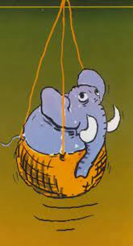

```{r libs, echo=FALSE, message=FALSE, warning=FALSE}
library(xaringanExtra)
library(emo)
library(fontawesome)
library(kableExtra)
```

```{r xaringan-logo, echo=FALSE}
# install.packages("remotes")
# remotes::install_github('yihui/xaringan')
# remotes::install_github("gadenbuie/xaringanExtra")
# xaringanExtra::use_logo(
#   image_url = "https://raw.githubusercontent.com/rstudio/hex-stickers/master/PNG/xaringan.png"
# )
xaringanExtra::use_logo( here::here('img/logo_dest.png'))
```

### *Housekeeping*

* Aproveitem o momento presencial para tirar dúvidas

* Se estivéssemos no ensino remoto ou à distância

  + vocês poderiam estar somente ouvindo, sem interação
  
  + ou assistindo vídeos e material em outro momento
  
* Depois das aulas, rever material da aula passada

  + fazer exercícios
  
  + se preparar para a próxima aula

---

## Aula passada `r emo::ji("disk")`
### Amostragem conglomerada em dois estágios 

* $\widehat T_{AC2S} = \frac {M} {m} \sum_{i \in a} \widehat T_i$, $\widehat T_i = \frac {N_i} {n_i} \sum_{j \in s_i} y_{ij}$. 

* $\widehat Var_{AC2S} \left( \widehat T_{AC2S} \right) = M^2 \left( \frac {1} {m} - \frac {1} {M} \right) \frac {1} {m-1} \sum_{i \in a} \left( \widehat T_i - \overline y_C \right)^2 + \frac {M} {m} \sum_{i \in a} N_i^2 \left( \frac {1} {n_i} - \frac {1} {N_i} \right) \widehat S_i^2$
  + $\overline y_C = \frac {1} {m} \sum_{i \in a} \widehat T_i$ estima a média por conglomerado $\overline {Y_C}$;  
  + $\widehat S_i^2 = \frac {1} {n_i-1} \sum_{j \in s_i} \left( y_{ij} - \overline {Y_i} \right)^2$ estima a variância dentro da UPA $i$.

---

## Aula passada `r emo::ji("disk")`
### Amostragem conglomerada em dois estágios 

* $\overline y_{AC2S} = \frac {\widehat T_{AC2S}} {N} = \frac {M} {mN} \sum_{i \in a} \widehat T_i = \frac {M} {mN} \sum_{i \in a} \frac {N_i} {n_i} \sum_{j \in s_i} y_{ij}$

* $\widehat Var_{AC2S} \left( \overline y_{AC2S} \right) = \frac {1} {N^2} \widehat Var_{AC2S} \left( \widehat T_{AC2S} \right)$ 

* $\widehat T_{AC2S} = \frac {M} {m} \sum_{i \in a} \widehat T_i$  

* $\small\widehat Var_{AC2S} \left( \widehat T_{AC2S} \right) = M^2 \left( \frac {1} {m} - \frac {1} {M} \right) \frac {1} {m-1} \sum_{i \in a} \left( \widehat T_i - \overline y_C \right)^2 + \frac{M} {m} \sum_{i \in a} N_i^2 \left( \frac {1} {n_i} - \frac {1} {N_i} \right) \widehat S_i^2$
                                                                                       
* Para obtenção dos estimadores da média populacional basta dividir os estimadores do total por $N$ e, para estimar a variância do estimador da média, dividir os estimadores da variância do total por $N^2$.

---

class: inverse, middle, center

# Eficiência e Coef. de Correlação Intraclasse na AC2S

Da **AC1S**


---

class: inverse, middle, center

# Tamanho de amostra na AC2S

---

## Para casa `r emo::ji("house")`

* Fazer a lista 4 de exercícios.

* Continuar exemplos.

<!-- Continuar o Exercício. -->

<!-- * Mostrar tamanho de amostra $n$ para AASc dentro dos estratos. -->

<!-- * Continuar exercícios do livro 'Amostragem: Teoria e Prática Usando R'    https://amostragemcomr.github.io/livro/estrat.html#exerc11 -->

* Ler o capítulo 4 da apostila da Profa. Vanessa.

* Ler seção 12.10 do livro 'Amostragem: Teoria e Prática Usando R'.

* Rever os slides.

<!-- * Ler BOlfarine e Bussab...da seção 11.3 do livro 'Amostragem: Teoria e Prática Usando R'. -->

<!-- * Preparação para avaliação parcial 2 -->

## Próxima aula `r emo::ji("stats")`

* Acompanhar o material no moodle.

Amostragem Conglomerad em 2 estágios

  + Efeito de planejamento e tamanho de amostra.

  + Laboratório de <i class="fa-duotone fa-people-group"></i>`r fa("r-project", fill = "steelblue")`

---

## Muito obrigado!

```{r echo=FALSE, fig.align='center', message=FALSE, warning=FALSE, out.width='20%', out.height='20%', paged.print=FALSE}

```
.center[
#### Fonte: imagem do livro *Combined Survey Sampling Inference: Weighing of Basu's Elephants*.
]


---

## Referências

<!-- Slides baseados no Capítulo 11 do livro -->

* [Amostragem: Teoria e Prática Usando o R](https://amostragemcomr.github.io/livro/index.html)

* **Elementos de Amostragem**, Bolfarine e Bussab.

<!-- Citações do Capítulo -->

<!-- * Neyman(1934) -->

* Cochran(1977)


<!-- * refazer calculos para amostagem aleatoria simples com reposicao -->
<!-- * alocacao... ou lab R comparando alocação proporcional e igual tamanho -->

<!-- listas de exercicios... -->
<!-- dois aspectos da disciplina... ter flexibilidade com teoria... exercitar os conceitos com exercicios teoricos e praticos -->

<!-- falar dos pesos na AES -->

<!-- valor z_alpha/2 significa z ou t -->

<!-- quem tiver interesse em conferir as fórmulas... mostra as conttas, gosta dessa pparte...posso contabilizar ponto extra... tem q ser o primeira... -->
<!-- o mesmo pode valer para os códigos e texto... -->
<!-- fazer o formulário -->
<!-- resumo de formulas -->

---

## Resumo da notação

---

## Trabalho

.center[
#### Tópicos em 
#### `Amostragem com Probabilidades Variáveis` 
#### e 
####`Amostragens Complexas`
]

* Escolher um tema dentre os tópicos que encerram o conjunto de disciplinas de Amostragem.

* Materiais disponíveis:
  + minicurso Sinape
  + minicurso Thomas
  + capítulos das nossas refeências

* Apresentar:
  + problema
  + delineamento e estratégia
  + 10 slides? máximo  
  + 15 min apresentacao + 5 min perguntas. presencial ou video

<!-- * falar com Ju -->

<!-- * Falar do meu problema  -->
<!-- 	+ ... -->

<!-- chamar rodrigo e ju e marcia, para as apresentacoes??? tem canecas do datathon -->
