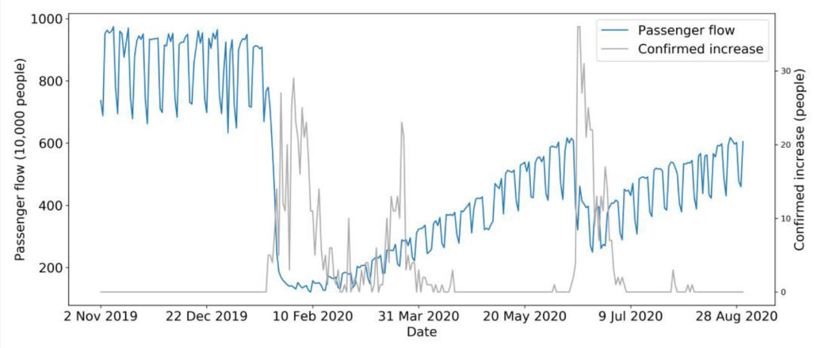

```{r libs, echo=FALSE, message=FALSE, warning=FALSE}
library(xaringanExtra)
library(emo)
library(fontawesome)
library(kableExtra)
```

```{r xaringan-logo, echo=FALSE}
# install.packages("remotes")
# remotes::install_github('yihui/xaringan')
# remotes::install_github("gadenbuie/xaringanExtra")
# xaringanExtra::use_logo(
#   image_url = "https://raw.githubusercontent.com/rstudio/hex-stickers/master/PNG/xaringan.png"
# )
xaringanExtra::use_logo( here::here('img/logo_dest.png'))
```

### *Housekeeping*

* Aproveitem o momento presencial para tirar dúvidas

* Se estivéssemos no ensino remoto ou à distância

  + vocês poderiam estar somente ouvindo, sem interação
  
  + ou assistindo vídeos e material em outro momento
  
* Depois das aulas, rever material da aula passada

  + fazer exercícios
  
  + se preparar para a próxima aula

---

## Aula passada `r emo::ji("disk")`
### Eficiência e Coef. de Correlação Intraclasse na AC2S

---

## Aula passada `r emo::ji("disk")`
### Tamanho de amostra na AC2S

---

class: inverse, middle, center

# Exercícios de avaliação AS e  AC2S

---

## Avaliação Parcial 3
### Questão 1

Comente vantagens e desvantagens do plano amostral de um estudo que, para estimar o número médio de usuários de certa linha de ônibus por viagem, tenha usado uma amostra sistemática de todas as primeiras saídas do dia desta linha por um mês. 

a. É possível definir este plano como uma **AC1**? De que forma?

b. Compare com um plano **AES** 

---

## Avaliação Parcial 3
### Questão 2

Seja o exemplo da frota de aviões do país com 10 cias. aéreas. Num primeiro estágio, 4 cias. foram sorteadas por **AASs**. Num segundo estágio, $n_i$ aviões foram sorteados também por **AASs** de cada cia. Os resultados foram:

Cia $(i)$ | $N_i$ | $n_i$ | $t_i = \sum_{j \in s_i} y_{ij}$ | $S^2_i$ | $\overline y_i$ | $\widehat T_i$
--|--|--|--|--|--|--
3 | 15 | 5 | 25 | 1 | 5 | 75
6 | 15 | 5 | 30 | 1,5 | 6 | 90
8 | 10 | 4 | 28 | 2,5 | 7 | 70
9 | 10 | 4 | 16 | 0,625 | 4 | 40
Total | 50 | 18 | 99 | - | - | 275

a. Defina a variável de interesse e um parâmetro de interesse.  
b. Escolha um estimador. É não viesado?  
c. Estime o parâmetro.  
d. Coeficiente de correlação intraclasse.(?)

---

class: inverse, middle, center

# Solução

---

## Avaliação Parcial 3
### Questão 1 - solução

Um exemplo de fluxo diário de passageiros

```{r bus_flow, echo=FALSE, fig.align='center', message=FALSE, warning=FALSE, out.width='100%', out.height='100%', paged.print=FALSE}

```
.center[
#### Fonte: do artigo *An Improved STL-LSTM Model for Daily Bus Passenger Flow Prediction during the COVID-19 Pandemic* (https://www.mdpi.com/1258480).
]

---

## Avaliação Parcial 3
### Questão 1 - solução

Possíveis vantagens: método simples de ser implementado

* para entrevistador pois terá definido o mesmo horário para seu trabalho?

* observar o dia todo seria de maior custo?

Desvantagens:

* Nos slides Aula 20, pg. 19, "Para populações periódicas, amostragem sistemática simples com
intervalo de seleção em sincronia com o período é um desastre (@Cochran1977, página 218)."

  + Nesse caso, observando o mesmo período todo o dia esperamos estar na situação em que o intervalo de observação $K$ seja múltiplo do período do (ciclo de) fluxo de passageiros.
  
  + Cochran sugere que seja utilizado um múltiplo ímpar de metade do período. 

---

## Avaliação Parcial 3
### Questão 1 - solução

* Na apostila, pg. 40, menciona Bolfarine e Bussab (2005), que 

  + indicam que na maioria das situações para estimar a variância do estimador da média sob **AS** pode ser usado o estimador da variância supondo **AASs**: 
  
  + "Esse estimador é adequado quando a **AS** é aproximadamente equivalente à **AAS**. Vale ressaltar que, quando as populações apresentam periodocididade ou tendências, as duas amostragens podem ter resultados bastante distintos. Por exemplo, vendas diárias de um certo produto no supermercado podem apresentar periodicididade."

---

## Avaliação Parcial 3
### Questão 1 - solução

a) No caso de uma **AC1S**, se considerarmnos dias como conglomerados (faz sentido?) selecionamos $m$ dias dos $M$ dias do mês, 

  + Teríamos o mesmo tamanho da amostra??? 

  + Esperaríamos diferenças de turno durante o dia e dias úteis e não úteis estarem presentes na amostra?

b) No caso de uma **AES**, poderíamos definir $H$ estratos como turnos, ou períodos do dia, e selecionaríamos $s_h$ dias dentro do mês?

  + Esperaríamos diferenças de turno durante o dia e dias úteis e não úteis estarem presentes na amostra?

---

## Avaliação Parcial 3
### Questão 2 - solução

```{r}
## dados do problema - slides Aula 13
i <- 1:10                                       # indice dos estratos
Ni <- c(10, 15, 15, 15, 10, 15, 15, 10, 10, 15) # tamanhos dos estratos
Ti <- c(40, 75, 75, 60, 60, 90, 75, 70, 40, 90) # totais dos estratos
N <- sum(Ni)                 # tamanho da populacao
M <- length(Ni)              # no. estratos na populacao 
m <- 4                       # no. estratos na amostra   
## dados adicionais questao 2 - slides Aula 23
a <- c(3, 6, 8, 9)           # indices dos conglomerados selecionados
ni <- c(5, 5, 4, 4)          # tamanhos de amostra em cada cluster
ti <- c(25, 30, 28, 16)      # totais das amostras em cada cluster
```

a) A variável de interesse, (observada em cada uma das unidades elementares)

$y$: distância (em milhas) percorrida pelas aéronaves das companhias aéreas de um país. 

---

## Avaliação Parcial 3
### Questão 2 - solução

* Possíveis parâmetros são: 
  
  + $T$ o total de milhas percorridas por todas as aeronaves do país;
  
  + $\overline Y$ a média de milhas percorridas por aeronave.

b) Escolha do estimador e justificativa  

* Para o total temos 
$$\widehat T^{HT}_{AC2S} = \frac {M} {m} \sum_{i \in a} \widehat T_i \: \: \: \: \: \text{ou} \: \: \: \: \: \widehat T^R_{AC2S} = N \frac{ \sum_{i \in a} \widehat T_i}{ \sum_{i \in a} N_i},$$
em que $\widehat T_i = \frac {N_i} {n_i} \sum_{j \in s_i} y_{ij}$

* Para a média  
$$\overline y^{HT}_{AC1S} = \frac {\widehat T_{AC1S/HT}}{N} \: \: \: \: \: \text{ou} \: \: \: \: \: \overline y^R_{AC2S} = \frac {\widehat T^R_{AC1S}}{N}.$$


---

## Avaliação Parcial 3
### Questão 2 - solução

O esimador escolhido é viesado ou não? Justificar.

$$E \left( \widehat T_{AC2S} \right) =  E_1 \left( E_2 \left( \widehat T_{AC2S} \right) \right) \: \: \: \text{ou} \: \: \: E \left( \overline y_{AC2S} \right) =  E_1 \left( E_2 \left( \overline y_{AC2S} \right) \right).$$

c) Estimativa do total, cálculos e interpretação.

```{r}
Ti_chapeu <- (Ni[a] / ni) * ti
T_chapeu_HT <- (M / m) * sum(Ti_chapeu)
n <- sum(ni)
T_chapeu_R <- (N / n) * sum(Ti_chapeu)
```

  + $\widehat T^{HT}_{AC2S} = \frac{`r M`}{`r m`} \left( `r paste0( "\\frac{", Ni[a], "}{", ni, "}", ti, collapse=" + ")` \right) = `r T_chapeu_HT`$. 
  + $\widehat T^{HT}_{AC2S} = \frac{`r N`}{`r n`} \left( `r paste0( "\\frac{", Ni[a], "}{", ni, "}", ti, collapse=" + ")` \right) = `r T_chapeu_R`$
  
Estimamos que a distância total percorrida por todas as aeronaves do país seja aproximadamente `r round(T_chapeu_HT,2)` (ou `r round(T_chapeu_R,2)`) milhas.
  

---

## Avaliação Parcial 3
### Questão 2 - solução

* para a média

```{r}
ybarra_HT <- T_chapeu_HT / N
ybarra_R <- T_chapeu_R / N
```

  + $\overline y^{HT}_{AC2S} = \frac{`r T_chapeu_HT`}{`r N`} = `r round(ybarra_HT,2)`.$ 
  + $\overline y^R_{AC2S} = \frac{`r T_chapeu_R`}{`r N`} = `r round(ybarra_R,2)`.$ 

Estimamos que a distância média percorrida por cada aeronave do país seja cerca de `r round(ybarra_HT,2)` (`r round(ybarra_R,2)`) milhas.

---

## Avaliação Parcial 3
### Questão 2 - solução

d) Coeficiente de correlação intraclasse.(slides Aula 22 e Apostila pg. 50)

$$EPA(AC2S) \approx 1 + \rho_{int} (\overline n - 1),$$

em que $EPA(AC2S) = \frac{Var_{AC2S} (\overline y)}{Var_{AASc} (\overline y)}$.
 
$\widehat Var_{AC2S} \left( \overline y_{AC1S} \right) = \frac {1} {\overline N^2} \left( \frac 1 m - \frac 1 M \right) \widehat S_{ec}^2$


---

## Para casa `r emo::ji("house")`

*  Continuar trabalho e apresentação final.

<!-- * Continuar exemplos. -->

<!-- Continuar o Exercício. -->

<!-- * Mostrar tamanho de amostra $n$ para AASc dentro dos estratos. -->

<!-- * Continuar exercícios do livro 'Amostragem: Teoria e Prática Usando R'    https://amostragemcomr.github.io/livro/estrat.html#exerc11 -->

<!-- * Ler o capítulo 4 da apostila da Profa. Vanessa. -->

<!-- * Ler seção 12.10 do livro 'Amostragem: Teoria e Prática Usando R'. -->

<!-- * Rever os slides. -->

<!-- * Ler BOlfarine e Bussab...da seção 11.3 do livro 'Amostragem: Teoria e Prática Usando R'. -->

<!-- * Preparação para avaliação parcial 2 -->

## Próxima aula `r emo::ji("stats")`

* Acompanhar o material no moodle.

Amostragem Conglomerada com probabilidades em 2 estágios

  + Efeito de planejamento e tamanho de amostra.

  + Laboratório de <i class="fa-duotone fa-people-group"></i>`r fa("r-project", fill = "steelblue")`

---

## Muito obrigado!

```{r echo=FALSE, fig.align='center', message=FALSE, warning=FALSE, out.width='20%', out.height='20%', paged.print=FALSE}
knitr::include_graphics('img/image_basu_elephant.jpg')
```
.center[
#### Fonte: imagem do livro *Combined Survey Sampling Inference: Weighing of Basu's Elephants*.
]


---

## Referências

<!-- Slides baseados no Capítulo 11 do livro -->

* [Amostragem: Teoria e Prática Usando o R](https://amostragemcomr.github.io/livro/index.html)

* **Elementos de Amostragem**, Bolfarine e Bussab.

<!-- Citações do Capítulo -->

<!-- * Neyman(1934) -->

* Cochran(1977)


<!-- * refazer calculos para amostagem aleatoria simples com reposicao -->
<!-- * alocacao... ou lab R comparando alocação proporcional e igual tamanho -->

<!-- listas de exercicios... -->
<!-- dois aspectos da disciplina... ter flexibilidade com teoria... exercitar os conceitos com exercicios teoricos e praticos -->

<!-- falar dos pesos na AES -->

<!-- valor z_alpha/2 significa z ou t -->

<!-- quem tiver interesse em conferir as fórmulas... mostra as conttas, gosta dessa pparte...posso contabilizar ponto extra... tem q ser o primeira... -->
<!-- o mesmo pode valer para os códigos e texto... -->
<!-- fazer o formulário -->
<!-- resumo de formulas -->

---

## Resumo da notação

---

## Trabalho

.center[
#### Tópicos em 
#### `Amostragem com Probabilidades Variáveis` 
#### e 
####`Amostragens Complexas`
]

* Escolher um tema dentre os tópicos que encerram o conjunto de disciplinas de Amostragem.

* Materiais disponíveis:
  + minicurso Sinape
  + minicurso Thomas
  + capítulos das nossas refeências

* Apresentar:
  + problema
  + delineamento e estratégia
  + 10 slides? máximo  
  + 15 min apresentacao + 5 min perguntas. presencial ou video

<!-- * falar com Ju -->

<!-- * Falar do meu problema  -->
<!-- 	+ ... -->

<!-- chamar rodrigo e ju e marcia, para as apresentacoes??? tem canecas do datathon -->
